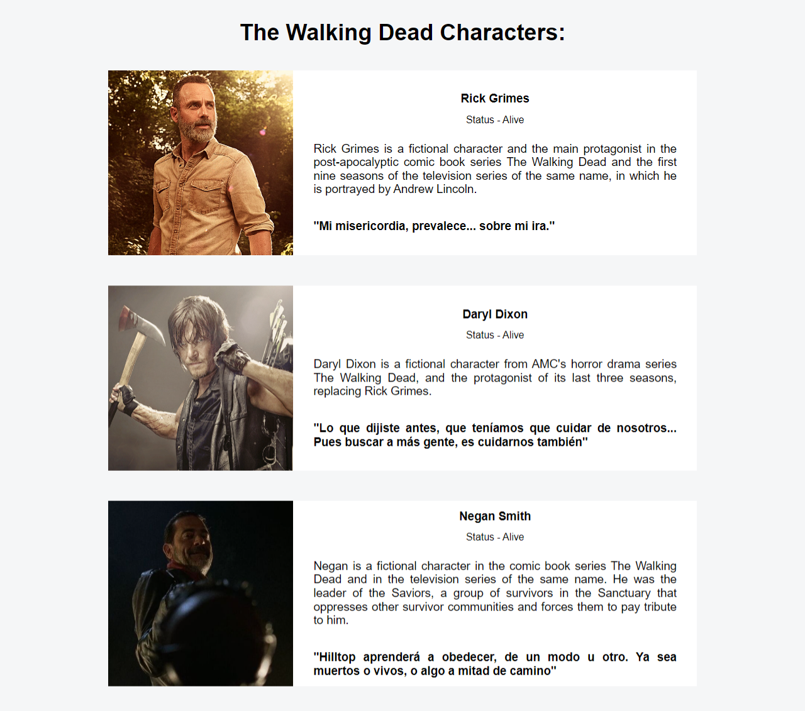
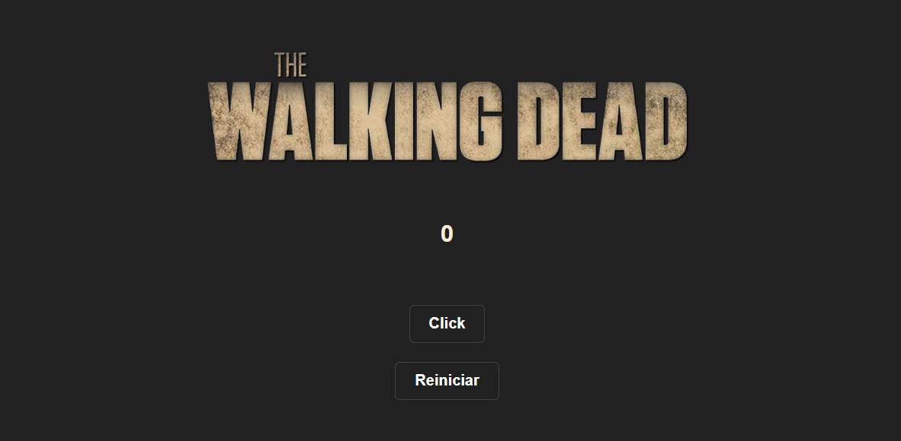

# React-FreeCodecamp

Proyectos react del curso de freecodecamp personalizados al estilo The Walking Dead :p 

**Conceptos y tecnologias aprendidos:** `Jsx`,`Props`, `useState`, `useEffect`, 

1 - 
[CLICK HERE](https://react-twd-characters.netlify.app/).

2 - 
[CLICK HERE](https://twd-counter.netlify.app/).

